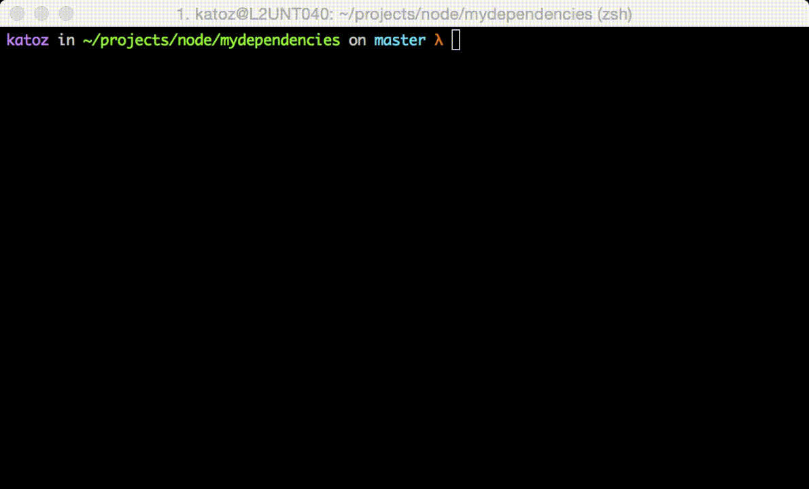

# Npm Run! [![NPM version][npm-image]][npm-url] [![Build Status][travis-image]][travis-url]

> nr, An alias for npm run

## What's nr 

`nr` is an  `npm run` alias to run npm scripts in a faster way and help you stay productive.

## Getting Started

### Install

```
npm install -g npmrun
```

### Usage 

```sh
nr script_name
```

### Examples

```sh
nr test
```




```
nr start
```


[downloads-image]: http://img.shields.io/npm/dm/npmrun.svg
[npm-url]: https://www.npmjs.org/package/npmrun
[npm-image]: http://img.shields.io/npm/v/npmrun.svg

[travis-url]: https://travis-ci.org/jansanchez/npmrun
[travis-image]: http://img.shields.io/travis/jansanchez/npmrun.svg

[coveralls-url]: https://coveralls.io/r/jansanchez/npmrun
[coveralls-image]: https://img.shields.io/coveralls/jansanchez/npmrun.svg

