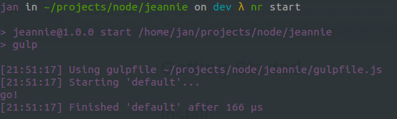
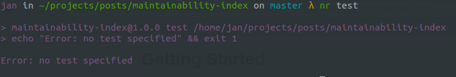

# Npm Run! [![NPM version][npm-image]][npm-url]

> nr alias for npm run

## Getting Started

### Install:

```
npm install -g npmrun
```

### How to use:

```
nr task_name
```

```
nr start
```



```
nr test
```




[downloads-image]: http://img.shields.io/npm/dm/npmrun.svg
[npm-url]: https://www.npmjs.org/package/npmrun
[npm-image]: http://img.shields.io/npm/v/npmrun.svg

