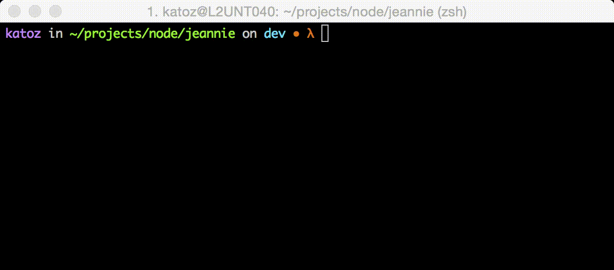

# Npm Run! [![NPM version][npm-image]][npm-url]

> nr, An alias for npm run

## What's nr 

`nr` is an  `npm run` alias to run npm scripts in a faster way and help you stay productive.

## Getting Started

### Install

```
npm install -g npmrun
```

### Usage 

```sh
nr script_name
```

### Examples

```sh
nr test
```


```
nr start
```




[downloads-image]: http://img.shields.io/npm/dm/npmrun.svg
[npm-url]: https://www.npmjs.org/package/npmrun
[npm-image]: http://img.shields.io/npm/v/npmrun.svg

